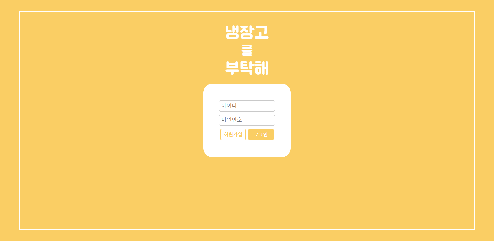
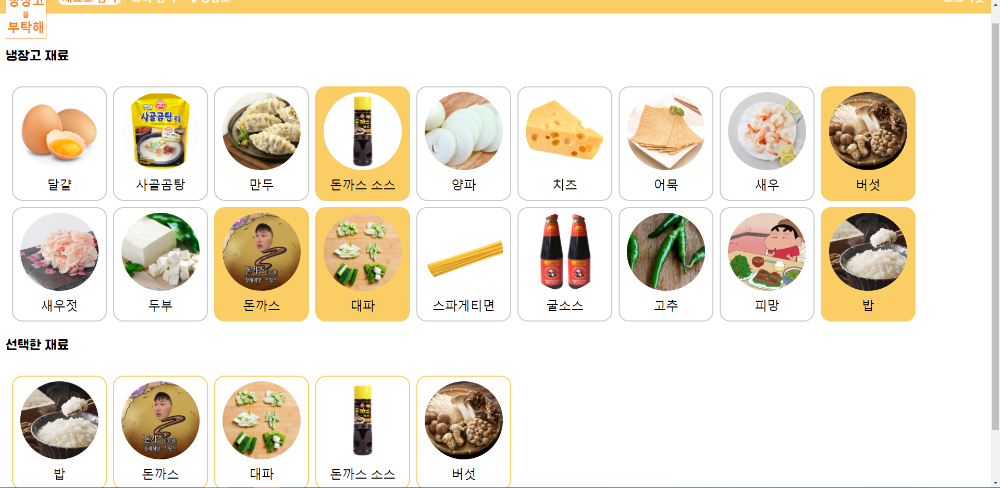
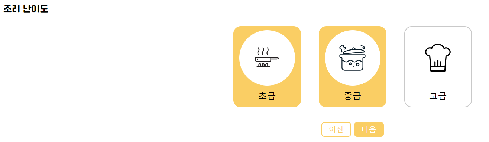
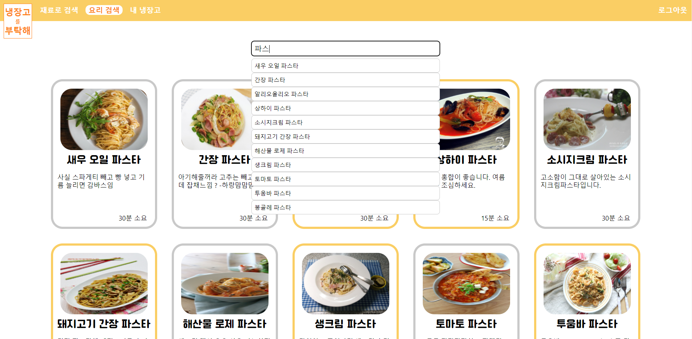
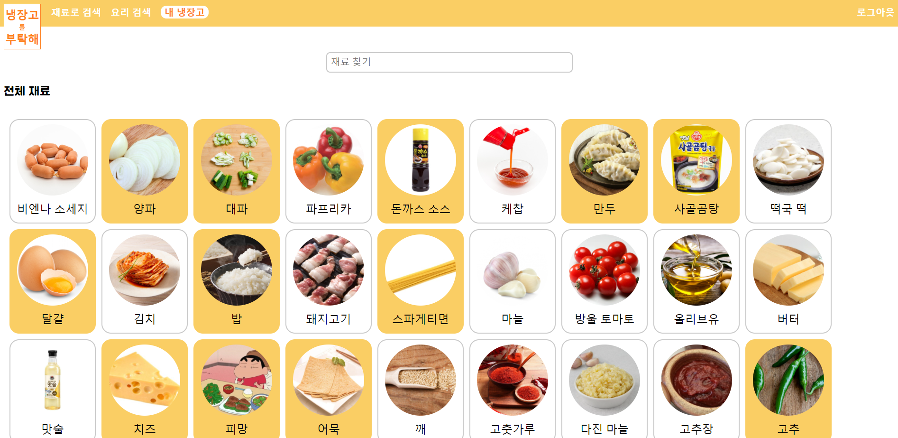

MadCamp week 4
=======================
몰입캠프 4주차 프로젝트입니다.

## 0. Project Name
냉장고 를 부탁해   

## 1. Member
- Moon Seokhoon
- Kim Seungku
- Jeon Seungyoon

## 2. Use Tool
<p>
    
    
    
    
    
</p>
<p></p>
웹 페이지를 제작하기 위해 프론트엔드로는 React를 사용했고,   
백엔드는 node.js를 사용했으며,   
데이터베이스로는 mysql을 사용했습니다.

## 3. Page Details
<p>
    
    
</p>
<p>
    
    
</p>
<p>
    
</p>

웹 페이지 "냉장고 를 부탁해"는 자취생들을 위해 레시들을 제공하는 사이트입니다.   
`재료로 검색` 탭에서 재료들과 시간, 난이도를 골라 조건에 부합하는 레시피들을 검색할 수 있습니다.    

<p>
    
</p>
<p></p>

또한 `요리 검색` 탭에서는 검색창을 통해 원하는 레시피를 찾을 수 있습니다.   
검색된 결과는 작은 카드뷰로 출력되며, 이를 누를 시 더욱 자세한 레시피를 설명해주는 사이트로 넘어갑니다.   

<p>
    
</p>
<p></p>

또한 회원가입과 로그인을 통해 각 사용자별로 `냉장고`를 관리할 수 있습니다.   
`냉장고`란 각 사용자 별로 가지고 있는 재료들을 미리 저장할 수 있는 곳을 말합니다.   
로그인 후 `내 냉장고`에서 재료를 미리 추가하거나 삭제할 수 있습니다.   
`냉장고`는 미리 DB에 저장되어 `재료로 검색` 탭에서 검색을 더욱 용이하게 도와줍니다.   

## 5. License
```
    Copyright [2021] [BUYA-GH, hye1ee]

    Licensed under the Apache License, Version 2.0 (the "License");
    you may not use this file except in compliance with the License.
    You may obtain a copy of the License at

    http://www.apache.org/licenses/LICENSE-2.0

    Unless required by applicable law or agreed to in writing, software
    distributed under the License is distributed on an "AS IS" BASIS,
    WITHOUT WARRANTIES OR CONDITIONS OF ANY KIND, either express or implied.
    See the License for the specific language governing permissions and
    limitations under the License.
```